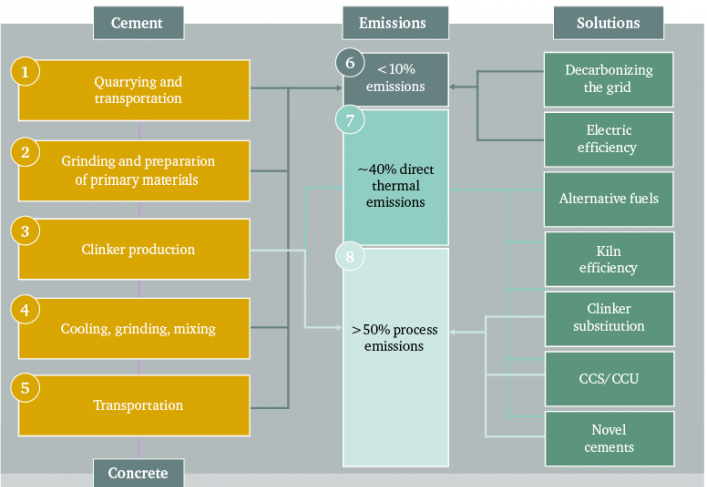

## Introduction

_Welcome to the first article in a 3-part series about the cement & concrete industries and their place in the climate fight. It provides a general introduction to the subject, with some surprising facts I discovered along the way._
 
_This is a personal perspective and is subject to change based on feedback and further discussions. Feel free to [reach out](mailto:erwin.kuhn@protonmail.com)!_

For the anecdote, Louis Vicat is the inventor of one of the first modern cement formulations in 1817! He also released his discovery to the world without any patent, which enabled tremendous improvements in construction efficiency at the time.

I've been working for the past year with Vicat, a large French cement group, on their climate strategy. More specifically, we are developing N-Zero, a modelling tool to create roadmaps towards carbon neutral cement. Coming from the computer science world, I had to learn everything along the way and I quickly became fascinated. 

Whenever I talk about my work, people often note that "it's great that the industry is making progress on climate questions, but don't forget: *it's still concrete after all*."

In this series, I want to unpack this observation. Especially the assumptions behind it. Why is concrete harmful? How is it harmful? Can "eco-friendly" concrete actually mean something? If so, how will the buildings and the material world around us evolve in response?

This article sets the decor, including a few things that really surprised me as I was learning about the subject. To be honest, I didn't understand how fundamental concrete is for our civilization before I started working on it.

## The difference between cement and concrete
Before we go any further, I  want to answer a question I get asked very often: what is the difference between cement and concrete?

Simply put, concrete is what you pour to build things. Cement is the glue that holds everything together. One way to understand it is the cake analogy 🎂: if concrete is a cake, cement is the flour that holds it together.

More precisely, cement is a fine powder that is mixed with sand and crushed rocks (called "aggregates") to form the concrete mix. Once the mix is hydrated, it starts to solidify and, after a short time, sets into a fixed structure.





## Concrete is everywhere

Concrete is one of those materials that is so fundamental to our lives that we barely pay attention to it. It has been in use since Antiquity and modern civilisation would not have been possible without it. It is [the most widely used man-made substance on the planet](https://www.iea.org/reports/technology-roadmap-low-carbon-transition-in-the-cement-industry) and **the second most used substance overall, right behind water**.

It's hard to get a sense of how much concrete we actually use.

First of all, it's hard to find accurate numbers for the global annual production of concrete. This is likely due to the very distributed nature of concrete manufacturing, which often happens in small production units, whereas cement is manufactured in large-scale plants, making reporting and accounting easier.

One gigatonne (Gt) is equal to 1 billion tonnes. It's a common unit to talk about things like global cement production or CO2 emissions. Every year, humanity puts around 40Gt of CO2 in the atmosphere.

Overall, the global production of cement is around 4 Gt/year. Taking 2020 numbers, that's 525 kg of cement per person on the planet per year!

Getting exact numbers for most industries is surprisingly hard. I detailed my sources in [the appendix](https://github.com/erwinkn/erwinkn.github.io/blob/main/content/blog/concrete/appendix.md)

Estimations for global concrete production put it at over 16 Gt/year. Cement-derived materials, which include a majority of concrete, represent [around 30% of global materials use](https://wedocs.unep.org/bitstream/handle/20.500.11822/25281/eco_efficient_cements.pdf), including fossil fuels. With some rough estimates, here is a chart for the global production of common materials, in gigatonnes per year:
    


As we can see, concrete dwarfs the other most common materials, like wood or steel, by far. I'm still surprised every time I see these numbers! Sure, I knew that we use a lot of concrete - but **more than all the other construction materials combined?** It's important to keep this in mind as we look into its environmental footprint.

## The climate impact of concrete (and other materials)

Concrete is often seen as dangerous for the environment. For good reason! The cement industry is the largest industrial emitter of greenhouse gas emissions, responsible for [7-8% of global  emissions](https://www.iea.org/reports/technology-roadmap-low-carbon-transition-in-the-cement-industry). It's also the third largest industrial energy consumer, representing 7% of the global industrial energy use.

Which refers to the  emitted during the production of the materials.

What is perhaps more surprising is that **concrete actually has a relatively low  footprint compared to other construction materials**. One way to see this is to look at the embodied  of common construction materials.

To this end, I compiled some data from the [Embodied Carbon database](https://circularecology.com/embodied-carbon-footprint-database.html), released in 2019, to obtain the following chart. **Disclaimer:** the boxes do not correspond to statistical quantities, like the median or quartiles, but representative values derived from the database. I described my methodology in [the appendix](https://github.com/erwinkn/erwinkn.github.io/blob/main/content/blog/concrete-intro/appendix.md).



To be clear, this is not an apple-to-apples comparison. 
First, I did not show the values for timber that count the carbon sequestered (CS) in the wood. I'll explain why below, but you can click here to make them appear:

Show me the timber!

Still, it turns out that overall, it is somehow more energy and  efficient to mine rock, heat it up to 1450°C and blend it with sand and more rocks than to simply cut down wood, process it and transport it. It is something I struggle to wrap my head around: concrete is in fact one of the lowest impact materials we can use for construction.

However, in the cases where we can account for carbon sequestration, timber becomes **strongly carbon-negative** and can be a great way to reduce the  footprint of buildings.

Another important dimension is that we don't care about the number of kilograms used, but the amount of each material needed for a given construction. Of course, the analysis becomes much more complicated. [In the only such study](https://pubs.acs.org/doi/10.1021/es202190r) I could find, concrete also comes out as the lowest impact material (not counting for carbon sequestration once again).

Deforestation is currently responsible for [around 6.5% of global  emissions](https://ourworldindata.org/deforestation?country=#one-third-of-co2-emissions-from-deforestation-are-embedded-in-international-trade)

To go back to timber, the negative  values only hold if the wood was grown in a sustainable manner and is properly disposed of at end of life. Otherwise, emissions from deforestation and the release of methane from decomposition could make the balance much worse.

By how much we can scale up our wood production in a sustainable manner, to replace concrete with products like [mass timber](https://www.archdaily.com/922980/is-cross-laminated-timber-clt-the-concrete-of-the-future), remains an open question for the future. 

Moreover timber doesn't magically make a building's carbon footprint disappear. Dependending on each project's configuration, as well as the type of wood product used, the gains can vary greatly. Even in "good" cases, the few comparative assessments I found estimated a reduction in global warming impact of [around 20%](https://www.researchgate.net/publication/340960305_Comparative_life-cycle_assessment_of_a_mass_timber_building_and_concrete_alternative) for a mass timber structure vs a reinforced concrete one.

While that's great, it shows clearly that we need to change our construction processes much more deeply, if we want to build for the climate and not against it.

Look at Roman constructions: they had developed an advanced understanding of concrete and some of their roads and bridges still stand today!

Concrete also has other properties which make it hard to replace:
- **Ease of use and versatility:** concrete is basically rock you can pour, which makes it usable with nearly zero training and equipment, and able to take a wide range of shapes.
- **Durability:** concrete buildings can easily last over 100 years. If our constructions last longer, we can build less and lower our environmental footprint.
- **Insulation:** higher energy efficiency in our built environment is [incredibly important](https://www.drawdown.org/solutions/insulation) on our path to reduce global  emissions. Concrete has a high thermal mass and low air infiltration, both important factors in enhancing the energy efficiency of buildings.
- **Adaptability:** your regular neighborhood concrete plant is able to offer hundreds of different formulations. Every concrete plant has a different set of them, adapted to local environmental conditions. This diversity means concrete can be used anywhere on Earth, from Siberia to the Sahara, for any construction type.

The moral of the story is two-fold. First, the plan should be: use as much sustainable wood as possible, and decarbonise concrete at the same time. There's no way around it, as concrete will very likely remain the major construction material far into the 21st century.

Second, the very large environmental footprint of the cement & concrete industry is not due to concrete being especially destructive in and of itself, but simply due to the incredibly high amounts of it we use as a civilization.





## Can we build less?

Naturally, the question that comes to mind after seeing the very large impact of concrete is: can we build less? Can we use less concrete?

[According to the International Energy Agency (IEA)](https://www.iea.org/reports/global-status-report-for-buildings-and-construction-2019), the buildings and construction sector accounted for 36% of final energy use and 39% of energy and process-related carbon dioxide (CO2) emissions in 2018.

So, can we build less?

Numbers taken from [Our World In Data](https://ourworldindata.org/) in November 2020.

The short answer is: no. Many people around the world still lack access to basic infrastructure such as clean water and electricity, world population is increasing and developing countries will need to build a lot more to continue improving their standards of living. About 1-in-3 people in cities are living in urban slums, with a lack of access to clean water, sanitation, sufficient living space or durable housing. 4.5 billion people, 60% of the world, do not have access to safely managed sanitation and 2.1 billion people do not have access to safe drinking water. The amount of infrastructure development that still needs to happen for the whole world to reach good living standards is staggering.

As often, it's helpful to look at historical trends to try and get a sense of where we are headed. Here is a graph showing world population, cement production and steel production from 1950 to 2015:





Over the last 65 years, global population has increased ~2.5x, while cement production has increased by over 30x, a much faster rate than other major materials like steel. Over the same time period, the world also saw the fastest increase in living standards in human history. 

To quote the [2016 New Climate Economy report](https://newclimateeconomy.report//2016) from the Global Commission on the Economy and Climate:

> _The world is expected to invest around US$90 trillion in infrastructure over the next 15 years, more than is in place in our entire current stock today._

Developing countries are expected to account for 2/3 of this amount. To get a sense of what that kind of development entails, here is an impressive statistic:





At the same time, from 1990 to 2014, China saw its share of urban population living in slums decrease from 44% to 25%. 

Given the amount of development still required to meet the UN's Sustainable Development Goals, it seems likely --- and even desirable --- that cement and concrete production will keep on increasing at a rapid rate in the near future.

## The CO2 problem {#co2problem}

Now that we've covered why it is incredibly important that we find a way to decarbonise the concrete industry, it's time to understand why it will be so difficult.

Concrete is particular in that nearly all of its embodied emissions come from cement production. And nearly all emissions related to cement are concentrated at a single point in the process: clinker production.

Portland cement is the standard cement manufacturing process today, used in [more than 98% of global concrete production](https://doi.org/10.1002/jctb.4927)

Clinker is the main component of ordinary Portland cement and gives it its binding power. Typically, cement is composed of 70-80% clinker, gypsum, supplementary cementitious materials (SCMs), which also provide binding power, and inert fillers.

Clinker is produced by heating limestone and other mineral materials, like clay, marl or shale, making up the raw meal to temperatures over 1400°C in the massive kilns sitting at the center of cement plants. At this point, the following chemical reaction happens:

$$\ce{CaCO3 -> CaO + CO2}$$

This is the calcination of limestone and the source of most of our problems here. The  emissions coming from this chemical reaction are called **process emissions** and make up **2/3rds of the  emissions associated with cement production.**

Over 4000MJ per ton of clinker in fact. That's roughly the energy contained in 100L of crude oil.

Firing up a cement kiln at 1450°C also requires a lot of energy and the combustion of fuels makes up **another third of total  emissions.**

What this implies is that, **even if we were able to operate cement plants entirely on carbon-neutral fuels, we would still be left with nearly two thirds of the emissions.**

Let's look at a detailed breakdown of the cement manufacturing process, associated emissions and possible solutions:





Taken altogether, quarrying, transporting and preparing the raw materials, then cooling, grinding, mixing and transporting them again after calcination makes up 10% of emissions. Clinker production is the remaining 90%, in large part due to the process emissions.

However, there's a very interesting consequence of all this: **concrete absorbs  from the air.** The chemical reaction we've seen above is actually one side of a triangle.





During clinker production, we take stable CaCO3 in the form of limestone and turn it at high temperatures into very reactive CaO --- also known as quicklime. Once it is incorporated into the concrete formulation and mixed with water, it rapidly turns into calcium hydrates Ca(OH)2 and solidifies.

Over the lifetime of the structure, those calcium hydrates revert into the more stable form of CaCO3, absorbing back the  process emissions that were emitted during clinker production.

Concrete used in a building for 80 years will [absorb around 20% of the process emissions](https://cembureau.eu/library/reports/2050-carbon-neutrality-roadmap/) associated with the clinker it contains. That's a lot! We will come back to this at the end of the article. In the meantime, it's worth thinking about how this very unique property could be used.

## Towards net-zero: the levers of decarbonisation

The cement & concrete industries encompass a complete value chain, going from quarrying rocks out of the Earth, to producing cement, then concrete, and delivering the final result for construction. And there are opportunities to reduce  emissions at every step along the way. However, it's possible to get a quick understanding of the landscape with the proper categories. So let's do just that!

A mental model which I find really helpful is the one given in the [2050 Carbon Neutrality Roadmap](https://cembureau.eu/library/reports/2050-carbon-neutrality-roadmap/) from CEMBUREAU. It illustrates the five stages of the cement & concrete value chain. _"Carbonation"_ refers to the  absorbed by concrete over time and ways we could accelerate it.





In the following, each decarbonisation lever will be annotated with the stage at which it applies.

### Energy efficiency <small class="text-darkSanguine">(clinker & cement)</small>
Thermal and electric efficiency gains can be achieved through optimisation of industrial processes and adoption of the best-in-class technologies. Overall, the potential here is minor: modern cement kilns are already [some of the most efficient industrial thermal machines in use](https://wedocs.unep.org/bitstream/handle/20.500.11822/25281/eco_efficient_cements.pdf). The [IEA global scenario](https://www.iea.org/reports/technology-roadmap-low-carbon-transition-in-the-cement-industry) estimates a 10% gain in thermal efficiency of clinker production by 2050, corresponding to 3% of the total emissions reductions for the cement industry.

### Fuel substitution <small class="text-darkSanguine">(clinker)</small>

Fuel substitution involves switching from fossil fuels to alternative fuels, often composed of waste products. It's also important to distinguish between biomass and non-organic waste.

By themselves, regular waste products release just as much  as fossil fuels. However, being able to use them productively has other advantages: it helps build the local economy and upcycle substances that would have to be handled in incinerators or landfills otherwise.

On the other hand, biomass fuel is generally considered to be carbon-neutral. Fuel substitution is mainly interesting from our climate perspective because it often leads to an increased use of biomass.

This is a very active area of work and **one of the major levers for short term emissions reductions** in the cement industry. Perhaps surprisingly, there are already European cement plants running on [over 80% alternative fuels](https://lowcarboneconomy.cembureau.eu/5-parallel-routes/resource-efficiency/alternative-fuels/). For instance, Vicat aims to achieve zero fossil fuels in Europe by 2025 and worlwide by 2030.

### Clinker substitution <small class="text-darkSanguine">(cement)</small> {#clinkersubst}
Since clinker production is where nearly all the  emissions happen, why not use something else? In fact, clinker substitution is another major area of work in the cement industry today. 

This leads to alterations in the structural properties of the resulting cement and concrete, like slower strength development. In most cases, this can be mitigated, but not all constructions can rely on those formulations.

The two materials most commonly used for this are fly ash and ground-granulated blast-furnace slag (or GBFS). They are byproducts of the coal and steel industry, respectively. Both can be used up to very high percentages (50+%) of the final cement mix.

Another promising material is calcined clay, which has the advantages of not coming from -intensive industries and offering a very large geological supply. The process is still in research & development, but [estimations](https://ecra-online.org/research/technology-papers/) are aiming for cements with up to 35-50% of the mix being calcined clay.

 accounting is a tricky business however. Currently fly ash and GBFS are considered to be 0 kg/t, which is simply not true. This leads to inaccurate claims by some manufacturers that their cement contains 80% or 90% less embodied emissions. The exact  content of these materials still needs to be determined, but they certainly have a role to play as the cement industry gets ready for more radical changes.

**Replacing clinker is the second very promising avenue for** strong reductions in the carbon footprint of cement and concrete in the next decade. One caveat is that fly ash and GBFS cannot be sustainable solutions in my opinion. As the coal industry winds down and steel production switches to other processes, like electric furnaces, their supply will decrease. Better alternatives will be needed.

### Carbon capture <small class="text-darkSanguine">(clinker)</small>
The idea here is simple as well: if you can't avoid  emissions in the process, capture them from the gas coming out of the kiln, before it gets into the atmosphere.

For comparison, coal plants have around 15%  in their flue gases.

This is the elephant in the room of low carbon cement. **Let's be clear: we won't get to net-zero emissions cement without carbon capture.** Cement production is also very well suited to it: very large plants concentrating nearly all the emissions, with a high  percentage (~30%) in the flue gases.

**On the other hand, [carbon capture is very expensive](https://www.mdpi.com/1996-1073/12/3/542), both energetically (+100-150%) and financially (+50-100%).** The technologies are still immature and may run into unexpected problems once they are put into production. As such, the point in time at which carbon capture can be deployed widely is very uncertain. For this reason, all the other decarbonisation levers outlined here are just as crucial in a complete roadmap towards carbon neutral concrete.

### Alternative cement formulations <small class="text-darkSanguine">(concrete)</small>

So far, all solutions above have focused on regular Portland cement. What about alternatives, you may ask?

There are indeed dozens of cement formulations other than Portland cement. There is however no catch-all solution that we could simply swap in. Often, the choice is strongly dependent on the construction type, as other cements have different physical properties, and the locally available materials.

In any case, nearly all alternative formulations I've seen still involve either calcination of limestone or a strong reliance on fly ash or GBFS, which have their own problems (see the paragraphs on [clinker substitution](#clinkersubst)). I will include resources on the subject at [the end of this article](#refs). Overall, [the consensus](https://ecra-online.org/research/technology-papers/) seems to be that we will likely see an expansion in the types of cements available and smarter choices made on a case-by-case basis -- but Portland cement will remain the vast majority of the market.

### Smarter use of concrete <small class="text-darkSanguine">(construction)</small>

I'll admit this is a bit of a catch-all section. At a high-level, the goal is to reduce the % of clinker in concrete, since nearly all embodied emissions come from there. Often those solutions can be win-win and help drive down costs as well, since clinker is one of the major contributors to the cost of concrete.

Concrete use can be optimised at multiple levels:
- **Using less concrete for the same structural elements through smarter design.** With an emphasis on "smarter": trying to minimise concrete use is sometimes counterproductive. If you use 10% less concrete but have to pick a more resistant formulation with 20% more clinker content, you end up with a higher carbon footprint.
- **Not overdosing cement in concrete.** Using more cement than specified in official standards or technical specs in concrete is common practice. In some cases it's necessary because of environmental conditions, sometimes it's "just to be safe" and make everyone's job easier. The consequence is that concrete sometimes end up with a 10-20% higher carbon footprint than necessary.
- **Using different types of cement and concrete,** focusing on reducing total  footprint. Possibilities here include changing the construction process to accomodate formulations with less clinker or using different concrete formulations in different parts of a building.

There are also a number of companies building technological innovations, ranging from [optimising concrete mix](https://alcemy.tech/en/) to [curing it](https://www.solidiatech.com/solutions.html) with .

Overall, [a report from the ETH Zürich](https://www.research-collection.ethz.ch/handle/20.500.11850/301843) showed that a combination of the measures above may reduce the carbon footprint of concrete used in construction by up to 50%! It's a strong demonstration that, despite the necessity of carbon capture at the clinker stage in the long run, there is a lot to be done at other stages of the value chain as well.

## Beyond net-zero

**Let's imagine that the year is 2050 and we've achieved carbon neutral cement**. We have incredibly efficient cement kilns running on [pure oxygen](https://en.wikipedia.org/wiki/Oxy-fuel_combustion_process), producing high-quality clinker and capturing 90+% of the  coming out. Due to better chemical formulations, smarter use of concrete and a necessity for the construction industry to achieve nearly zero embodied emissions, all the innovations outlined above have become the new normal.

But remember, concrete absorbs  during its lifetime. This means that our buildings have not only reduced their footprint: **they are now actively removing carbon from the atmosphere.** Even better, we may have found ways to accelerate the recarbonation process and leverage it to achieve [higher resistances with less cement](https://www.carboncure.com/). Upon destruction, the concrete remnants of old buildings are recycled, absorbing even more  in the process.

Needless to say, an incredible amount of work needs to be done before we can reach that stage. But let's keep this in mind: this is what the future could look like. Over the course of a few decades, the concrete industry could go from the most carbon-intensive industrial sector to being **one of the major sinks of  in the world.**

Concrete is one of the most crucial sectors in our transition to a carbon-neutral world and is deeply fascinating. Yet, I feel it is often overlooked compared to other areas of interest in discussions around the climate. I highly encourage ambitious folks to come tackle the problem, both within existing organisations, and by building new ones. There's a real shift in the industry right now. The questions it not *"will we reach net-zero?"* anymore, but *"how will we do it?"*

## Final words and references {#refs}

Thanks for making it this far! Hopefully this proved both informative and enjoyable.

The second article in the series will cover the technologies and actions that could help decarbonise concrete in much more depth, leveraging some of my modelling work.

The third article will be quite different, bordering on science fiction. The goal is to imagine what a carbon neutral construction industry would look like. I'm still not sure of what the answer is, but I'm excited to find out.

I have linked many references in this piece, but a few reports and papers have been crucial to shape my understanding of the subject. If you're interested in diving deeper, here are my recommandations:

- As an introduction to the subject, [the first chapter of *"Making Concrete Change"*](https://www.chathamhouse.org/2018/06/making-concrete-change-innovation-low-carbon-cement-and-concrete-0/1-introduction) from Chatham House is fantastic. The rest of the report is just as interesting, I regularly come back to it.
- [The IEA roadmap towards low carbon cement](https://www.iea.org/reports/technology-roadmap-low-carbon-transition-in-the-cement-industry) is both very clear and a major reference in most reports and academic papers I've seen. You'll need to create an account, but the report is free.
- [*A sustainable future for the European Cement and Concrete Industry*](https://www.research-collection.ethz.ch/handle/20.500.11850/301843) from the ETH Zürich considers the whole value chain, including concrete and construction, whereas most other reports focus solely on cement production. It outlines a very interesting scenario: the authors try to achieve the highest reductions possible in concrete's carbon footprint, *without carbon capture* (spoiler: they reach a high number).
- For a detailed discussion of cement, concrete & sustainability, the UNEP report [*"Eco-efficient cements"*](https://wedocs.unep.org/bitstream/handle/20.500.11822/25281/eco_efficient_cements.pdf) covers nearly everything. The 6th chapter on "The Limitations of Earth Chemistry" is short and worth a read, explaining from first principles why our current formulation for hydraulic cements is pretty much the only possible one.
- If you're interested in alternative cement formulations, there are two great papers accompanying the UNEP report above: [*"Alternative cement clinkers"*](https://www.sciencedirect.com/science/article/abs/pii/S000888461630775X) (Gartner & Sui, 2017) and [*"Alkali-activated-materials"*](https://www.sciencedirect.com/science/article/abs/pii/S0008884616307700) (Provis, 2018)

*Many thanks to Laurent Duveau and Eric Bourdon from Vicat for their expertise and advice, my good friend Guillaume Dupuy for the always pertinent feedback and all the people that have patiently listened to me talk about concrete for hours.*